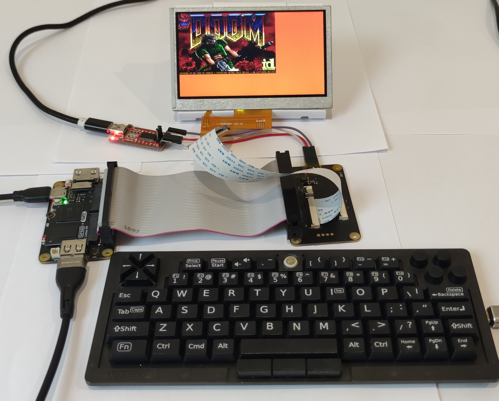
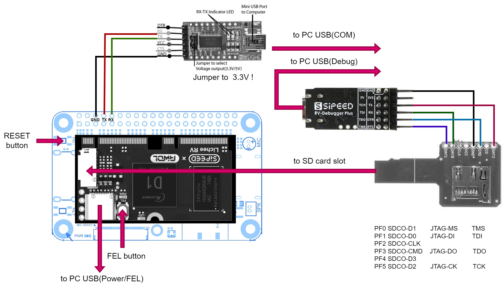

# Overview

HAL (Hardware Abstraction Layer) for [Allwinner D1H](https://d1.docs.aw-ol.com/en/)/D1s/F133 RISC-V SOC.<br>
Is minimal bare-metal library could be used to run own OS or whatever. A dependency-free, register-level C library.<br>
Mostly based on @robots [allwinner_t113](https://github.com/robots/allwinner_t113) and @ua1arn [hftrx](https://github.com/ua1arn/hftrx) projects.

## Features
- You can play DOOM on this!

- Working graphics with LCD RGB 4.3 inch (043026-N6(ML) ST7701S SPI)
- USB Host with support USB 2.0/1.0 Keyboard, Mouse
- TWI (I2C) supported AXP228 Power management chip
- UART, GPIO

## Details
- LCD MIPI/LVDS not work yet (6.86 inch icnl9707)
- USB not work from SD card image, from xfel work ok
- UART output is blocking 

## Executed at hardware such as:
- [Sipeed Lichee RV + Dock](https://wiki.sipeed.com/hardware/en/lichee/RV/Dock.html)

# Installation
In repository exist pre-builded images for SD card in folder [image](image), need to flash it to SD card and install to device.
- For ClockworkPi DevTerm R01 board please use [image/sd_image_devterm.img](image/sd_image_devterm.img)
- For Sipeed Lichee RV board please use [image/sd_image_lichee.img](image/sd_image_lichee.img)

## Windows
Could use https://etcher.balena.io/#download-etcher for flash image to SD card.

## Linux
```sh
dd if=image/<platform>_sd_image.img of=/dev/sdb
```

## Run
Configure UART adapter to 115200 baud rate, 8N1 (screen /dev/ttyUSB0 115200).<br>
Insert flashed SD card to device OR flash by XFEL and power on, should see at the end of output like this:
```
[INF]:  \ | /
[INF]:  - Allwinner D1 HAL [ver: 0.0.1-5-gd69c9f1]
[INF]:  / | \
[INF]:  SoC: D1H
[INF]:  Platform: ClockworkPi Devterm R-01
[DBG]:irq_init
[DBG]:twi_init
```

## Environment
Tested on Ubuntu 22.04.3 64x.
On machine need to be installed make environment:
```sh
sudo apt install git make build-essential pkg-config libusb-1.0-0-dev libncurses5-dev unzip screen
```
If needed to specify installation folders for toolchain please modify environment.sh script to specify this variable
- TOOLCHAIN_INSTALL_DIR - path for installation dir for toolchain ex.: $HOME/toolchain

Then execute due each session:
```sh
source ./environment.sh
```
Or add to ~/.bashrc

## Environment setup with virtual machine
In my case I was use Windows 10 64x as a host with and Ubuntu virtual machine as a guest for compilation.
Repo was downloaded to a shared folder in Windows and then mounted in Ubuntu:
```sh
sudo apt install open-vm-tools
sudo mkdir /mnt/hgfs/
sudo vmhgfs-fuse .host:/share /mnt/hgfs/ -o allow_other -o uid=1000
```
/etc/fstab example
```sh
.host:/    /mnt/hgfs/    fuse.vmhgfs-fuse    defaults,allow_other,uid=1000     0    0
```

## Build toolchain

Installing toolchain
```sh
make toolchain

* T-HEAD_DebugServer will request specify installation dir: 'Set full installing path:'
  Could be seted as $HOME/toolchain or allwinner_d1_hal/toolchain folder
```
Will be installed:
- xpack-riscv-none-elf-gcc-14.2.0-2-linux-x64 (for compiling)
- xfel                  (for flash MCU by USB)
- T-HEAD_DebugServer    (for JTAG)

## Build project

Clone all needed libs
```sh
make submodules
```

Compile firmware ('D1H' SoC and 'Sipeed Lichee RV' platform by default)
```sh
make
```

Compile firmware for specific platform ClockworkPi Devterm R-01 platform
```sh
make soc=d1h platform=devterm
```
**soc** could be: d1h, d1s <br>
**platform** could be: sipeed, devterm

Clean all objects
```sh
make clean
```

Flash firmware to MCU by XFEL
```sh
make flash
```

## Build SD card image

To create SD card image in [image](image) folder:
```sh
make sd
```

To create SD card image for ClockworkPi Devterm platform
```sh
make sd platform=devterm
```

For flash to SD card:
```sh
make sd_burn
```

## Debugging

For debugging used Sipeed RV-Debugger Plus with [T-Head CKLink firmware](https://github.com/bouffalolab/bouffalo_sdk/tree/master/tools/cklink_firmware).   
To connect debugger to board need use MicroSD breakout board because in D1H JTAG pins mapped to SD Card [pins](https://linux-sunxi.org/JTAG).

For flash firmware to Sipeed RV-Debugger Plus - Press and hold the boot pin then plug the usb in the computer to go to the boot mode. And execute command:
```sh
make debug-burn
```

To start GDB session in device that have FEL button (Sipeed Lichee RV) - press and hold the FEL button then press RESET button to go to the FEL mode, then execute command OR for device without FEL button (Clockwork Devterm) just don't insert boot SD card, press POWER button and execute command:
```sh
make debug
```

Should see at the output like this:
```
+---                                                    ---+
|  T-Head Debugger Server (Build: Oct 21 2022)             |
   User   Layer Version : 5.16.05
   Target Layer version : 2.0
|  Copyright (C) 2022 T-HEAD Semiconductor Co.,Ltd.        |
+---                                                    ---+

...
GDB connection command for CPUs(CPU0):
        target remote 127.0.0.1:1025
...

0x000000000000a22a in ?? ()
Restoring binary file build/app.bin into memory (0x40000000 to 0x40600000)
```

## Hardware details
- [Sipeed Lichee RV + Dock](https://wiki.sipeed.com/hardware/en/lichee/RV/Dock.html)
- Lichee RV Dock extension LCD adapter board
- 4.3 RGB LCD Display (043026-N6(ML)) with IC ST7001s (SPI)
- FTDI 2248-c USB/UART adapter
- Sipeed RV-Debugger Plus
- MicroSD_Sniffer

### Sipeed Lichee RV assembly


# Links
https://forum.clockworkpi.com/t/r-01-library-for-small-os/15602 <br>
https://bbs.aw-ol.com/topic/6113/r-01-library-for-small-os <br>
https://whycan.com/t_11784.html <br>

## TODO:
- LCD mipi (take dsi driver from Linux or RTT)
- USB not work from SD card image
- Do as library and external main function
- ehci/ohci auto switch
- LCD output double buffered
- MMU
- No libc ?
- simple linker script ?
- FreeRTOS ?
- Own bootloader
- Changelog
- Kbuild ? obj-y ?
- Common for T113 ?
- spi-nand ?